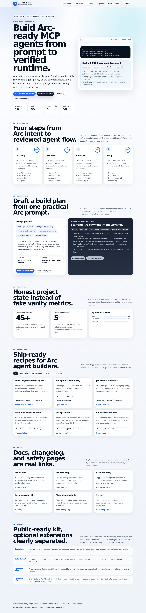
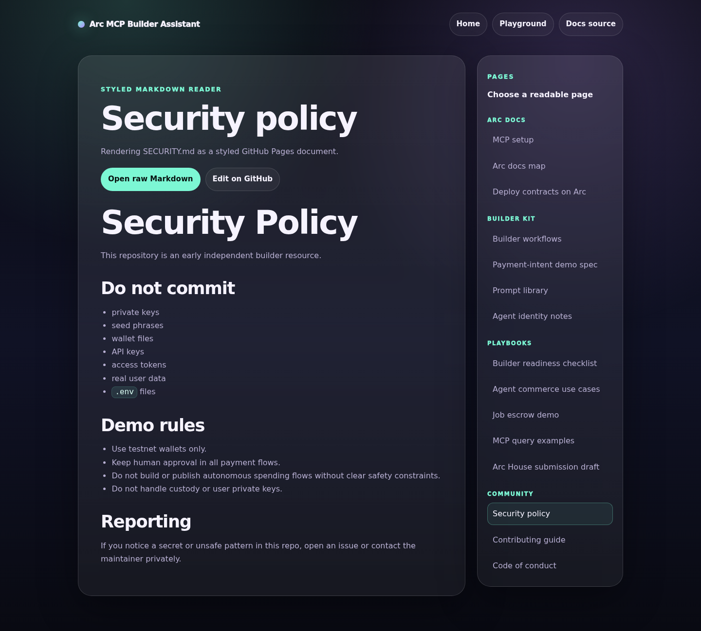
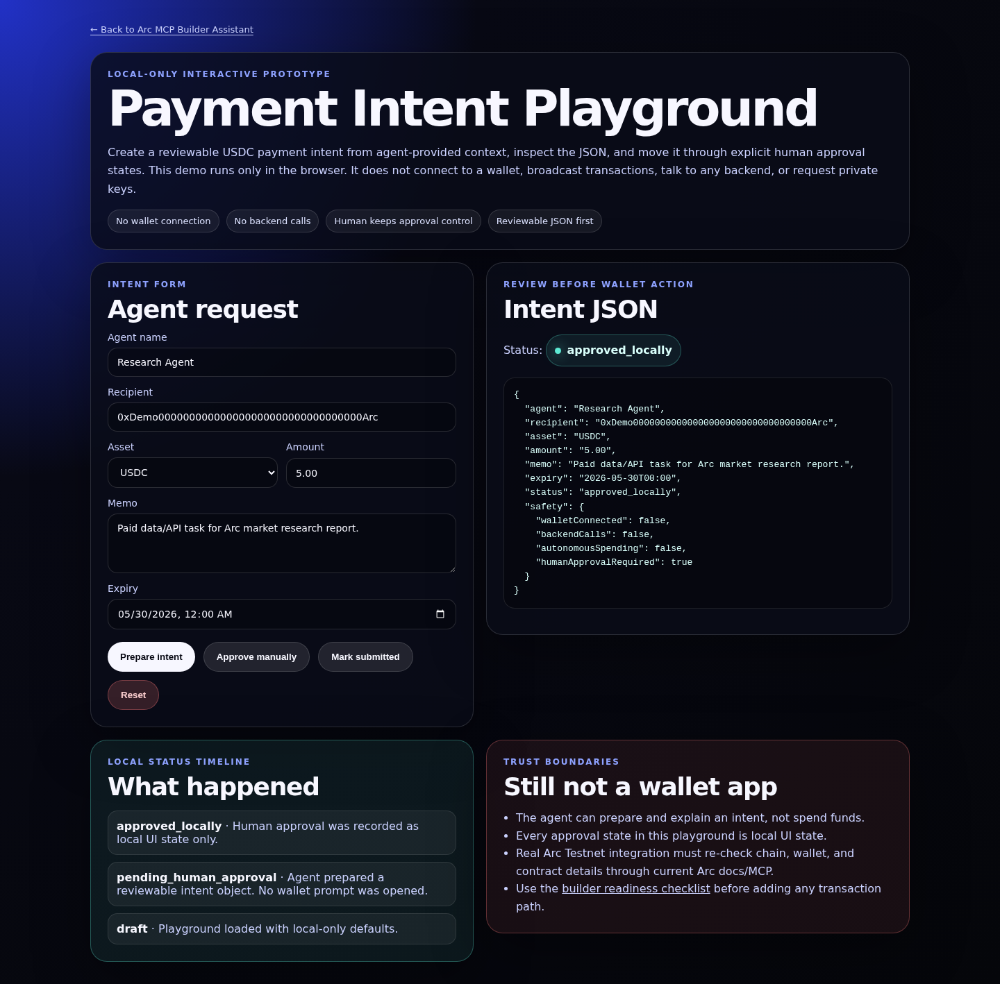
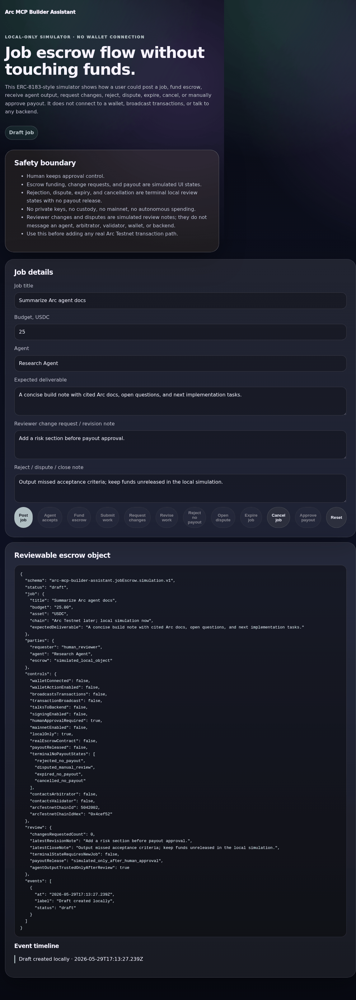

# Arc MCP Builder Assistant

[](https://github.com/Anstrays/arc-mcp-builder-assistant/actions/workflows/validate.yml)
[](./LICENSE)
[](#status)
[](https://anstrays.github.io/arc-mcp-builder-assistant/)

> Independent early-stage builder resource for exploring Arc's MCP server, AI-assisted development workflows, and agentic commerce prototypes.

Arc MCP Builder Assistant is a lightweight documentation + prompt kit that helps builders use Arc's official MCP/docs surface with AI coding tools to prototype faster.

The first version focuses on three practical workflows:

1. **Connect AI tools to Arc docs through MCP** — so builders can ask targeted questions and retrieve relevant docs while coding.
2. **Generate better Arc app plans** — prompts for payment flows, agent registration, stablecoin FX, and agentic commerce.
3. **Prototype Arc agent payment concepts** — a minimal payment-intent demo spec that can evolve into a working testnet app.

This repository is intentionally scoped as a builder enablement kit, not an official Arc product.

## Table of contents

- [Why this matters](#why-this-matters)
- [Current MVP](#current-mvp)
- [Screenshots](#screenshots)
- [Roadmap](#roadmap)
- [Suggested use](#suggested-use)
- [Local development](#local-development)
- [Repository structure](#repository-structure)
- [Safety and honesty](#safety-and-honesty)
- [Contributing](#contributing)
- [Status](#status)

## Why this matters

Arc's public docs and positioning point toward stablecoin-native finance, agentic economy applications, autonomous agents, onchain identity, and developer-friendly payment infrastructure.

Many builders want to explore that direction, but the first step is often messy:

- finding the right docs;
- translating docs into implementation tasks;
- creating safe AI-coding prompts;
- scoping a realistic first demo;
- documenting what works and what fails.

This kit turns those steps into reusable guides, prompts, and examples.

## Current MVP

- [`docs/view.html`](./docs/view.html) — styled GitHub Pages Markdown reader so landing-page docs and community-health links open readable pages instead of raw text.
- [`docs/arc-mcp-setup.md`](./docs/arc-mcp-setup.md) — real Arc MCP setup steps for Claude Code, Claude Desktop, Cursor, VS Code, Windsurf, and HTTP MCP clients.
- [`docs/arc-docs-map.md`](./docs/arc-docs-map.md) — practical map of Arc Testnet config, contracts, agent primitives, tutorials, tools, and the recommended build path.
- [`docs/deploy-contracts-arc.md`](./docs/deploy-contracts-arc.md) — builder notes from Arc's deploy-contracts tutorial using Circle Contracts and Arc Testnet.
- [`docs/agent-identity-erc8004.md`](./docs/agent-identity-erc8004.md) — ERC-8004 agent identity notes and trust-boundary guidance.
- [`docs/builder-workflows.md`](./docs/builder-workflows.md) — practical Arc + AI builder workflows.
- [`docs/payment-intent-demo.md`](./docs/payment-intent-demo.md) — first demo specification.
- [`docs/prompt-library.md`](./docs/prompt-library.md) and [`prompts/`](./prompts/) — copy-paste prompts for AI coding tools, including the standalone Arc Testnet status prompt.
- [`docs/arc-builder-readiness-checklist.md`](./docs/arc-builder-readiness-checklist.md) — pre-submit checklist for docs grounding, payment safety, UX states, repo quality, and public proof-of-work.
- [`docs/arc-testnet-integration-runbook.md`](./docs/arc-testnet-integration-runbook.md) — safe sequence for the next real Arc Testnet payment-intent integration.
- [`docs/agent-commerce-use-cases.md`](./docs/agent-commerce-use-cases.md) — practical use cases for API-call payments, creator payouts, job escrow, AI-service marketplace flows, and report agents.
- [`docs/job-escrow-demo.md`](./docs/job-escrow-demo.md) — ERC-8183-style flow for posting jobs, funding escrow, reviewing agent output, and releasing stablecoin payouts.
- [`docs/mcp-query-examples.md`](./docs/mcp-query-examples.md) — prompts that force AI tools to separate retrieved Arc facts, implementation suggestions, and unknowns.
- [`docs/arc-house-submission.md`](./docs/arc-house-submission.md) — ready-to-edit builder update for Arc community or Arc House-style submissions.
- [`docs/build-log.md`](./docs/build-log.md) — public milestone note and community-update draft for sharing the current local-first builder kit.
- [`examples/payment-intent-playground/`](./examples/payment-intent-playground/) — local-only interactive playground for editing a payment request, inspecting live JSON, and simulating approval/submission states.
- [`examples/job-escrow-simulator/`](./examples/job-escrow-simulator/) — local-only ERC-8183-style job escrow simulator for posting, accepting, funding, submitting, and approving a payout.
- [`examples/x402-local-challenge-server/`](./examples/x402-local-challenge-server/) — dependency-free local HTTP 402 challenge server with a swappable verifier boundary for future Circle/x402 settlement work.
- [`examples/payment-intent-demo/`](./examples/payment-intent-demo/) — tiny static mockup for the first payment-intent flow, including trust-boundary and review-state UI copy.

## Screenshots

These screenshots are committed so reviewers can quickly see the live-site UX without clicking through every page.









## Roadmap

### Phase 1 — Documentation kit

- [x] Publish MCP setup checklist.
- [x] Publish Arc builder prompt library.
- [x] Publish payment-intent demo spec.
- [x] Publish Arc docs map with network config, core contracts, ERC-8004, ERC-8183, and event-monitoring roadmap.
- [x] Add contract-template notes from Arc's deploy-contracts tutorial for ERC-20, ERC-721, ERC-1155, and Airdrop.
- [x] Add agent identity notes around Arc's ERC-8004 tutorial.
- [x] Add builder readiness checklist, MCP query examples, agent-commerce use cases, job escrow demo spec, and Arc House submission draft.
- [x] Turn the payment-intent mockup into a local interactive playground with reviewable JSON and status transitions.
- [x] Turn the job escrow spec into a local simulator with reviewable JSON and human-approved payout state.
- [x] Add a styled Markdown docs viewer for GitHub Pages so docs links render like pages instead of raw text.
- [x] Route community-health pages through the styled viewer and add committed screenshots for reviewer proof.
- [x] Add a public build log and refreshed Arc House submission draft.
- [x] Add Arc Testnet integration runbook and read-only RPC status helper.
- [ ] Share build log in Arc community.

### Phase 2 — Working prototype

- Build a small web UI for agent payment intents.
- Use the local playground as the review-first baseline before wallet integration.
- Use Arc Testnet config from the docs map: RPC, chain ID, USDC gas, and ArcScan.
- Use Arc MCP docs to verify current testnet and wallet details.
- Start with the read-only `scripts/check_arc_testnet_status.py` helper before adding wallet signing.
- Add Circle Dev-Controlled SCA Wallet notes for Arc Testnet.
- Add optional Circle Contracts template deployment notes for receipts, credits, or payout demos.
- Track transaction/payment status.
- Add a short tutorial.

### Phase 3 — Agent commerce starter kit

- Add agent identity notes around Arc's ERC-8004 tutorial.
- Extend the local job escrow simulator with richer failure states after the payment-intent playground is wired to verified testnet status.
- Add reusable components for agent cards, payment requests, receipts, and logs.
- Add example flows for creator payouts, API payments, and AI-agent commerce.

## Suggested use

Use this repo with an AI coding assistant that supports MCP or can read local docs.

Example task:

```text
Use Arc MCP/docs context and this repo to design a minimal Arc payment-intent demo where an AI agent requests a USDC payment and the user approves it manually.
```

## Local development

The repo is intentionally dependency-free: only Python 3 (used by the
validator) and a web browser are required.

```bash
# Validate the repo the same way CI does.
python3 scripts/test_x402_boundary.py
python3 scripts/validate_repo.py

# Optional read-only Arc Testnet status check.
python3 scripts/check_arc_testnet_status.py

# Preview the static site locally (matches GitHub Pages behavior).
python3 -m http.server 8080
# then open http://localhost:8080/

# Run the local-only x402 challenge boundary demo.
python3 examples/x402-local-challenge-server/server.py --port 8087
# then request http://localhost:8087/protected
```

The validator checks for required files, obvious credential patterns,
basic HTML safety / accessibility / SEO invariants on every public HTML page,
local links, reduced-motion CSS coverage, payment-demo safety copy, styled-viewer
coverage for public Markdown pages, the local-only x402 verifier boundary,
no raw Markdown links in user-facing HTML, and the integrity of `robots.txt`
and `sitemap.xml`. It runs on every push and pull request
via [`.github/workflows/validate.yml`](./.github/workflows/validate.yml).

## Repository structure

```text
.
├── index.html                       # Landing page (GitHub Pages root)
├── 404.html                         # Branded GitHub Pages "Not found" page
├── robots.txt                       # Crawler directives + sitemap pointer
├── sitemap.xml                      # XML sitemap for the deployed site
├── docs/                            # Builder documentation
│   ├── view.html                    # Styled GitHub Pages Markdown docs reader
│   ├── viewer.js                    # Dependency-free local Markdown renderer
│   ├── arc-mcp-setup.md
│   ├── arc-docs-map.md
│   ├── deploy-contracts-arc.md
│   ├── builder-workflows.md
│   ├── payment-intent-demo.md
│   ├── arc-builder-readiness-checklist.md
│   ├── arc-testnet-integration-runbook.md
│   ├── agent-commerce-use-cases.md
│   ├── job-escrow-demo.md
│   ├── mcp-query-examples.md
│   ├── arc-house-submission.md
│   └── build-log.md
├── prompts/                         # Copy-paste prompts for AI coding tools
├── examples/
│   ├── payment-intent-demo/         # Static UI mockup of the v0 demo flow
│   ├── payment-intent-playground/   # Local-only interactive intent playground
│   ├── job-escrow-simulator/        # Local-only ERC-8183-style escrow flow simulator
│   └── x402-local-challenge-server/ # Local-only 402 challenge/verifier boundary demo
├── assets/screenshots/              # Committed preview proof for reviewers
├── scripts/
│   ├── check_arc_testnet_status.py  # Read-only Arc Testnet RPC status check
│   ├── test_x402_boundary.py        # Regression tests for the local x402 boundary
│   └── validate_repo.py             # CI / local validation script
├── .github/                         # Workflows, issue & PR templates
├── CODE_OF_CONDUCT.md
├── CONTRIBUTING.md
├── SECURITY.md
├── LICENSE
└── README.md
```

## Safety and honesty

- Do not paste private keys, wallet seed phrases, access tokens, or API keys into AI tools.
- Do not imply official Arc endorsement unless confirmed.
- Treat all generated code as a draft until tested against current Arc docs.
- Keep claims honest: this is an early independent builder resource.

See [`SECURITY.md`](./SECURITY.md) for the full security policy and how
to report issues privately.

## Contributing

Contributions are welcome — corrections to MCP setup notes, verified Arc
docs links, prompt improvements, testnet integration notes, payment-intent
demo improvements, or agent-identity / ERC-8004 docs.

See [`CONTRIBUTING.md`](./CONTRIBUTING.md) for the contribution checklist
and [`CODE_OF_CONDUCT.md`](./CODE_OF_CONDUCT.md) for community
expectations.

## Status

Early MVP scaffold. Built in public as an Arc builder experiment.
